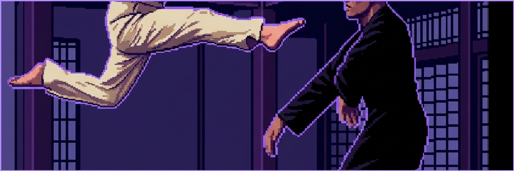
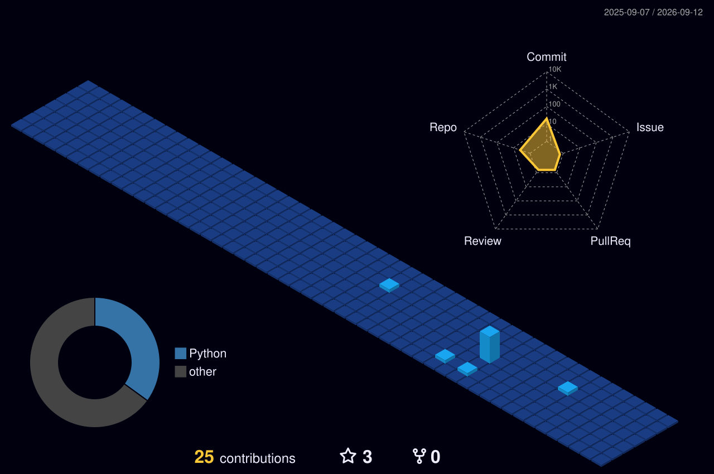

<!-- 상단 레트로 16비트 보라 배너 (1200x400 크롭 및 보라색 보더 가미) -->

  

 

<!-- 테크 미니멀리즘 텍스트 블록쿼트 소개 (엑스박스 방지 및 프로페셔널 톤) -->
<blockquote>
  

    <strong>15년 기획 안목의 B2B AX 컨설턴트</strong> 
    <strong>G-Stack 1인 기업 자동화 설계자</strong> 
    <strong>AI Agentic Workflow 엔지니어</strong>
  

</blockquote>

 

## 🛠️ Tech Stack & Agent Frameworks
<!-- 기술 뱃지 (보라색 테마 #6B3FA0 일괄 통일로 디자인 아이덴티티 극대화) -->

  
  
  
  
  
  

 

---

## 📊 My 3D Contribution Space
<!-- 3D 잔디 노출 (보라색/밤하늘 테마인 profile-night-view.svg 적용 및 엑박 방지 상대경로 교정) -->

  

 

## 🐍 Contribution Snake
<!-- 스네이크 게임 노출 (엑박 방지 상대경로 교정) -->

  

 

---

## 📈 Git Stats
<!-- 깃허브 스탯 카드 (보라색 테마 최적화 및 title_color=B48CFF) -->

  
  

