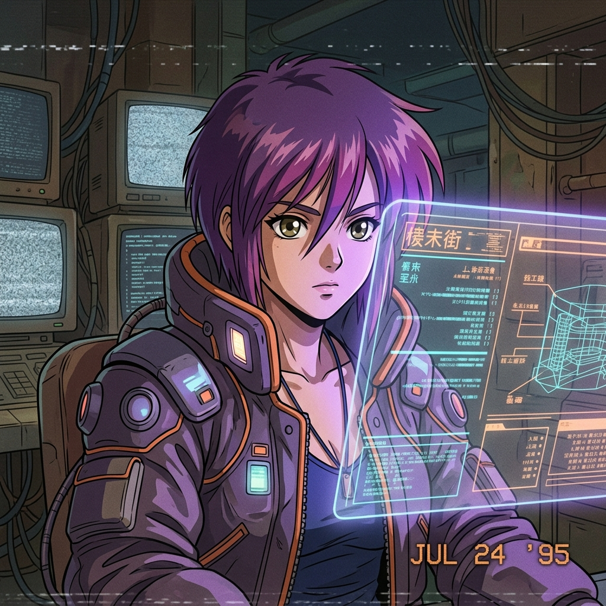

<!-- 상단 Capsule Render 배너 및 실시간 타이핑 효과 (보라색 테마 #B48CFF 조합) -->

  
  

 

<!-- 메인 대시보드 벤토 그리드 (Bento Grid) -->
<table border="0" cellpadding="10" cellspacing="0" width="100%">
  <tr>
    <!-- 좌측 열: 프로필 아바타 + 영문 바이오 + 기술 배지 -->
    <td width="35%" valign="top" align="center" style="border-right: 1px solid #1f242c;">
      
        
      <strong>GODAN TECH</strong>
      

        Building autonomous agentic workflows and LLM integrations. Automates ideas into production code.
      

      

      

         
         
         
         
         
        
      

    </td>
    <!-- 우측 열: 3D Contribution Space + 스네이크 애니메이션 -->
    <td width="65%" valign="top">
      <h3 style="margin-top: 0; color: #B48CFF;">📊 My 3D Contribution Space</h3>
      
        
      <h3 style="color: #B48CFF;">🐍 Contribution Snake</h3>
      
    </td>
  </tr>
</table>

 

<!-- 하단 섹션: Git Stats 카드 -->
<h3 align="center" style="color: #B48CFF;">📈 GitHub Metrics</h3>

  
  

  

<!-- 90s Retro LCD 방문자 카운터 (Moe Counter) -->

  

