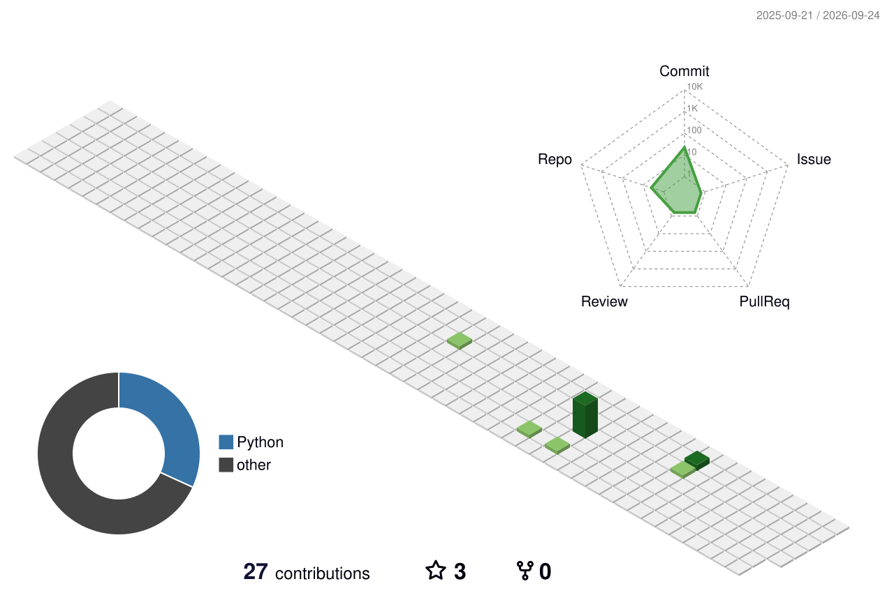

<!-- 상단 파도 배너 (Capsule Render - GitHub 다크 테마 배경 매칭 및 텍스트 짤림 방지) -->

  

<!-- 실시간 타이핑 한 줄 소개 (Neon Mint 컬러 바인딩) -->

  

 

## 🛠️ Tech Stack & Agent Frameworks
<!-- 기술 뱃지 (Shields.io + Neon Mint 테마 통일) -->

  
  
  
  
  
  

 

---

## 📊 My 3D Contribution Space
<!-- 3D 잔디 노출 -->

  

 

## 🐍 Contribution Snake
<!-- 스네이크 게임 노출 -->

  

 

---

## 📈 Git Stats
<!-- 깃허브 스탯 카드 (Dark 모드 및 테마 최적화) -->

  
  

